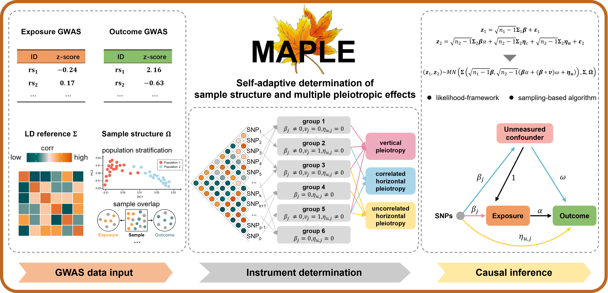

# MAPLE Overview



MAPLE is an R package for efficient statistical inference of mendelian randomization analysis. MAPLE utilizes a set of correlated SNPs, self-adaptively accounts for the sample structure and the uncertainty that these correlated SNPs may exhibit multiple pleiotropic effects, as well as explicitly models both uncorrelated and correlated horizontal pleiotropy. MAPLE is implemented as an open-source R package, freely available at <https://github.com/yuanzhongshang/MAPLE>.

# Installation
You can install the released version of MAPLE from Github with the following code.

Dependencies

* R version >= 3.6.0
* R packages: Rcpp, RcppArmadillo, RcppDist, dplyr, magrittr, readr

## 1. Install devtools if necessary

```
install.packages('devtools')
```

## 2. Install MAPLE

```
devtools::install_github('yuanzhongshang/MAPLE')
```

## 3. Load package

```
library(MAPLE)
```

## Issues

All feedback, bug reports and suggestions are warmly welcomed! Please make sure to raise issues with a detailed and reproducible example and also please provide the output of your sessionInfo() in R!

# How to use MAPLE
The MAPLE User Manual: [here](MAPLE_user_manual.pdf)
